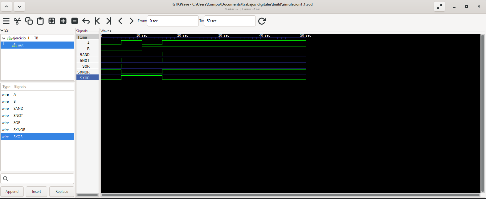
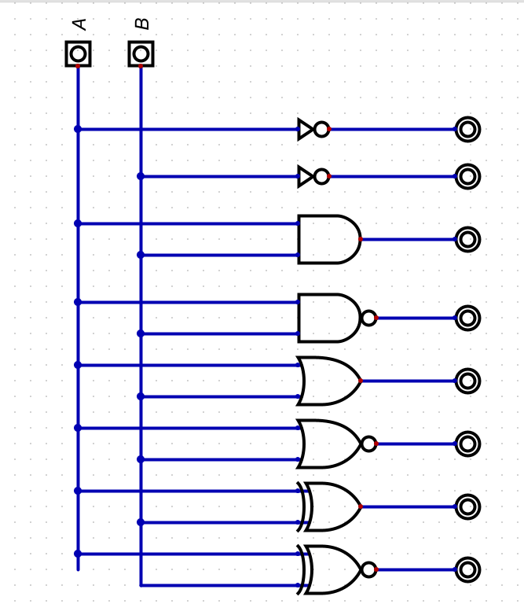
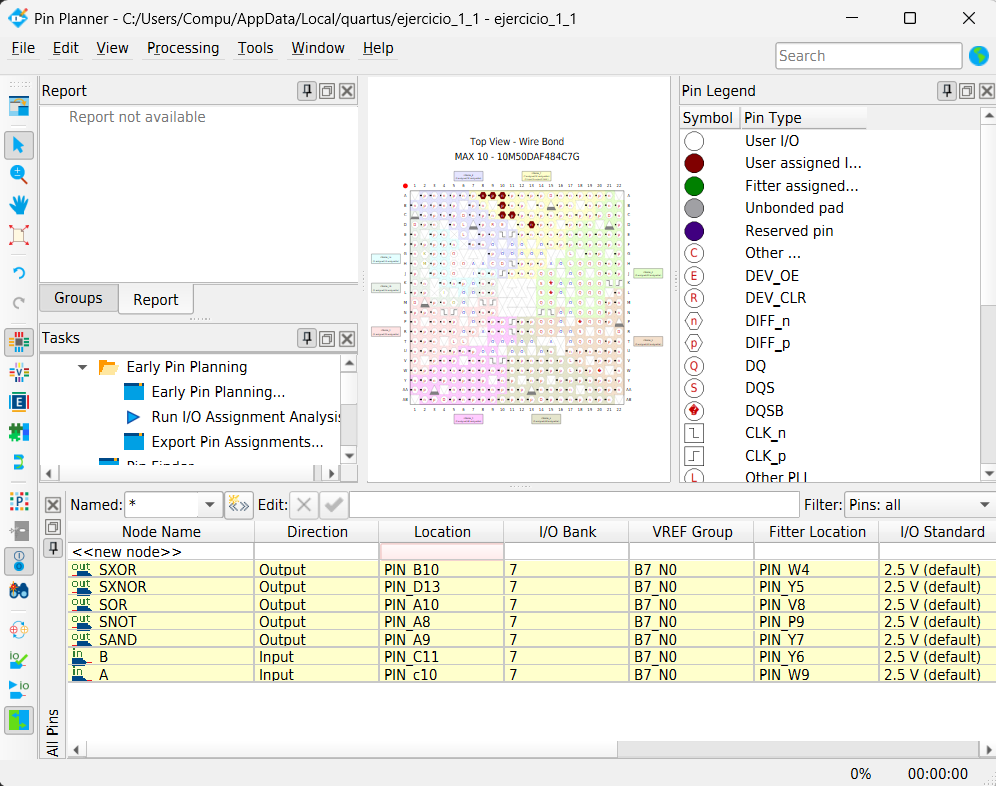
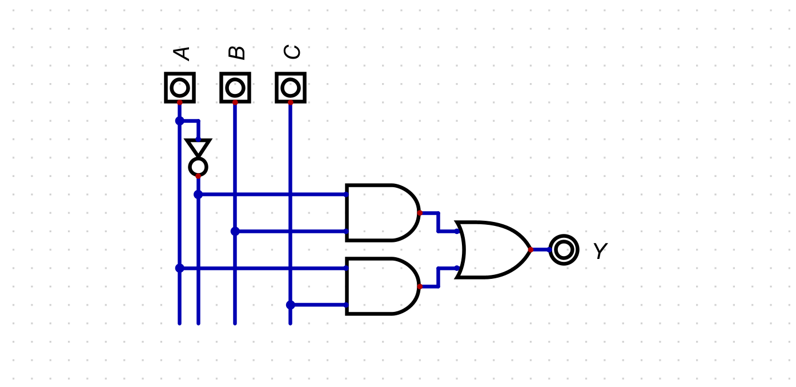
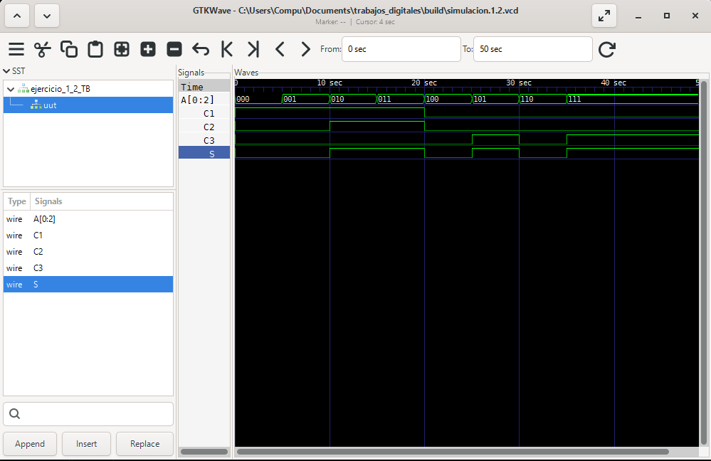
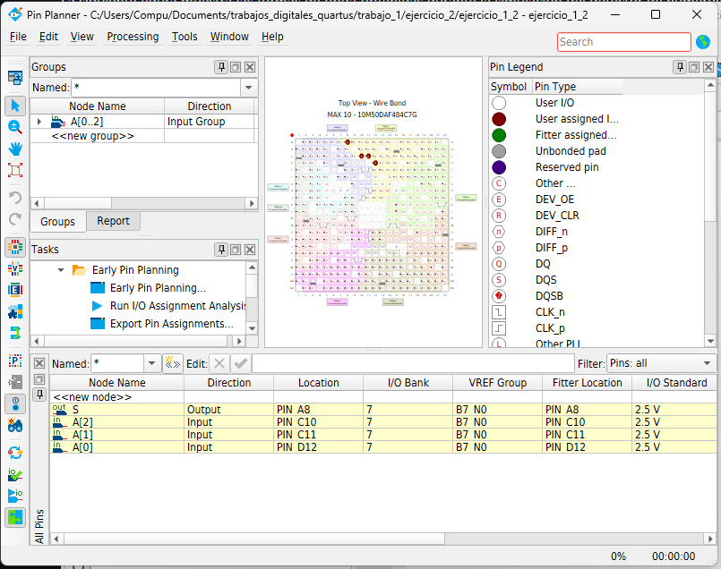
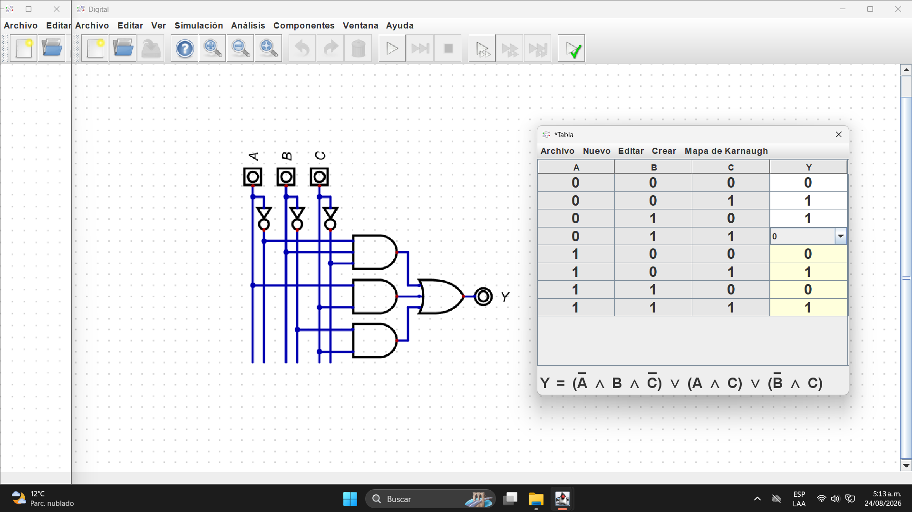
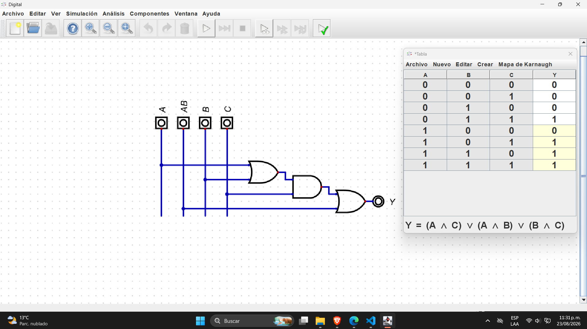

        
# Lab01 - Sumador/Restador de 4 bits

# Integrantes
    * [<!-- juan carlos ramos arias. -->](<!-- juancramosar-droid -->) 
    * [<!-- daniel ducuara. -->](<!-- Remplace aqui link de usario 2 de github -->) 
    * [<!-- Remplace aqui nombre 3. -->](<!-- Remplace aqui link de usario 3 de github -->) 
# Informe

Indice:

1. [Documentación](#documentación-de-los-circuitos-implementados-implementado)
2. [Simulaciones](#simulaciones)
3. [Evidencias de implementación](#evidencias-de-implementación)
4. [Preguntas](#preguntas)
5. [Conclusiones](#conclusiones)
6. [Referencias](#referencias)

1 Documentación del diseño implementado

1.1.0 compuertas logicas
En esta primera parte del laboratorio se implementaron las compuertas
lógicas fundamentales **NOT, AND, OR, XOR y XNOR** mediante lenguaje
Verilog.

El objetivo fue comprobar su funcionamiento y relacionar cada operación
lógica con su correspondiente tabla de verdad.

Las entradas del circuito se definieron como `A` y `B`, mientras que
cada compuerta genera una salida independiente. Para la compuerta
**NOT** únicamente se utiliza la entrada `A`.

- **NOT:** invierte el estado lógico de la entrada.
- **AND:** genera una salida lógica `1` únicamente cuando ambas entradas son `1`.
- **OR:** genera una salida `1` cuando al menos una de las entradas es `1`.
- **XOR:** genera una salida `1` cuando las entradas presentan valores diferentes.
- **XNOR:** genera una salida `1` cuando ambas entradas presentan el mismo valor lógico.

| Compuerta | Expresión |
|---|---|
| NOT | `Y = ~A` |
| AND | `Y = A & B` |
| OR | `Y = A \| B` |
| XOR | `Y = A ^ B` |
| XNOR | `Y = ~(A ^ B)` 

En Verilog estas operaciones pueden implementarse mediante operadores lógicos o mediante primitivas
propias del lenguaje. En este laboratorio se utilizaron ambas formas con el propósito de observar que
producen el mismo comportamiento lógico.
posteriormente, el diseño fue simulado para verificar que las salidas obtenidas coincidieran con los
valores esperados de la tabla de verdad.
        
1.1.1 Descripción

En esta actividad se diseñó un circuito combinacional en **Verilog**
para implementar las compuertas lógicas **NOT, AND, OR, XOR y XNOR**.

El sistema utiliza las señales `A` y `B` como entradas y genera una
salida independiente para cada operación lógica.

La implementación permite observar directamente el comportamiento de
cada compuerta ante las diferentes combinaciones de entrada.

Posteriormente, el circuito fue simulado para comparar las salidas
obtenidas con las tablas de verdad correspondientes y comprobar el

1.1.2 Diagramas
El circuito correspondiente a las compuertas lógicas fue representado en el simulador **Digital**, permitiendo 
visualizar la conexión entre las entradas y las diferentes operaciones lógicas implementadas.
#### Tabla de verdad

La siguiente tabla muestra el estado de las salidas para cada combinación posible de las entradas `A` y `B`.

| A | B | NOT A | AND | OR | XOR | XNOR |
|:---:|:---:|:---:|:---:|:---:|:---:|:---:|
| 0 | 0 | 1 | 0 | 0 | 0 | 1 |
| 0 | 1 | 1 | 0 | 1 | 1 | 0 |
| 1 | 0 | 0 | 0 | 1 | 1 | 0 |
| 1 | 1 | 0 | 1 | 1 | 0 | 1 |

**Tabla 1.** Tabla de verdad correspondiente a las compuertas lógicas implementadas.

1 Simulaciones 

1.1 Descripción

Para verificar el funcionamiento del diseño se utilizó **Icarus Verilog** como herramienta de compilación y simulación del
código HDL, complementado con **GTKWave** para la visualización gráfica de las señales generadas durante la simulación.
Icarus Verilog permite compilar el módulo diseñado y su correspondiente archivo de prueba o *testbench*. A partir de la ejecución 
de la simulación se genera un archivo de formas de onda, el cual posteriormente es abierto en GTKWave.

Mediante GTKWave se observaron las señales de entrada `A` y `B`, junto con las salidas correspondientes a las compuertas 
**NOT, AND, OR, XOR y XNOR**. Se probaron todas las combinaciones posibles de las entradas con el fin de comprobar que las salidas 
obtenidas coincidieran con los valores establecidos en la tabla de verdad.

El flujo utilizado para la simulación fue:

`Código Verilog → Testbench → Icarus Verilog → Archivo de ondas → GTKWave`

A continuación se presentan las formas de onda obtenidas durante la simulación.

1.2 Simulación compuertas logicas

### 2.1 Simulación de compuertas lógicas

La siguiente figura muestra las formas de onda obtenidas mediante **Icarus Verilog** y visualizadas en **GTKWave**. En la simulación
se observan las entradas `A` y `B`, junto con las salidas correspondientes a las compuertas `AND`, `NOT`, `OR`, `XNOR` y `XOR`.



**Figura 2.** Simulación de las compuertas lógicas mediante Icarus Verilog y GTKWave.

1.2.1 Diagrama
#### 1.1.2 Diagramas

El siguiente diagrama corresponde a la implementación de las compuertas lógicas en el simulador **Digital**, donde se representan las entradas
y las salidas asociadas a cada operación lógica.



**Figura 1.** Diagrama de las compuertas lógicas implementadas en el simulador Digital.

1.3 Evidencias de implementación.

Para la implementación física del diseño se utilizó **Quartus Prime** como entorno de desarrollo para compilar y cargar el código **Verilog**
en una tarjeta **FPGA DE10-Lite**.
Inicialmente, se creó un proyecto en Quartus y se agregó el archivo Verilog correspondiente al circuito diseñado. Posteriormente, se definió
el módulo principal como **Top-Level Entity** y se realizó el proceso de **Analysis & Synthesis** para verificar que el código no presentara 
errores de sintaxis ni de descripción lógica.
Una vez validado el diseño, se utilizó la herramienta **Pin Planner** para asignar las entradas y salidas del circuito a los pines físicos de 
la FPGA. Las señales de entrada fueron asociadas a los interruptores de la tarjeta y las señales de salida a los LED disponibles en la DE10-Lite.
Después de realizar la asignación de pines, se ejecutó la compilación completa del proyecto, generando el archivo de programación correspondiente.
Finalmente, mediante la herramienta **Programmer** de Quartus y una conexión USB-Blaster, se cargó el diseño en la FPGA DE10-Lite.
La implementación permitió comprobar físicamente el comportamiento de las compuertas lógicas, verificando que las salidas observadas en los LED 
coincidieran con los resultados obtenidos previamente en la simulación.

#### Código Verilog implementado

El siguiente código corresponde a la implementación de las compuertas lógicas mediante primitivas de Verilog.

```verilog
module ejercicio_1_1(
    input A,
    input B,
    output SAND,
    output SNOT,
    output SOR,
    output SXOR,
    output SXNOR
);

    and  (SAND,  A, B);
    not  (SNOT,  A);
    or   (SOR,   A, B);
    xor  (SXOR,  A, B);
    xnor (SXNOR, A, B);

endmodule
```

#### Testbench

Para verificar el funcionamiento de las compuertas lógicas se desarrolló un **testbench** que genera las cuatro combinaciones posibles de las entradas `A` y `B`. Los resultados de la simulación se almacenan en un archivo `.vcd`, posteriormente visualizado mediante **GTKWave**.

```verilog
// Se incluye el archivo que contiene el módulo principal
`include "laboratorio_1_1.v"

// Se define la escala de tiempo
`timescale 1s/1s

module ejercicio_1_1_TB();

// Entradas del circuito utilizadas durante la simulación
reg A_TB;
reg B_TB;

// Salidas del circuito
wire SAND_TB;
wire SOR_TB;
wire SNOT_TB;
wire SXOR_TB;
wire SXNOR_TB;

// Instancia del módulo que se desea comprobar
ejercicio_1_1 uut (
    .A(A_TB),
    .B(B_TB),
    .SAND(SAND_TB),
    .SOR(SOR_TB),
    .SNOT(SNOT_TB),
    .SXOR(SXOR_TB),
    .SXNOR(SXNOR_TB)
);

initial begin

    // Caso 1: A = 0, B = 0
    A_TB = 1'b0;
    B_TB = 1'b0;

    #5;

    // Caso 2: A = 1, B = 0
    A_TB = 1'b1;
    B_TB = 1'b0;

    #5;

    // Caso 3: A = 0, B = 1
    A_TB = 1'b0;
    B_TB = 1'b1;

    #5;

    // Caso 4: A = 1, B = 1
    A_TB = 1'b1;
    B_TB = 1'b1;

    #5;

end

initial begin : TEST_CASE

    // Archivo utilizado para visualizar las señales en GTKWave
    $dumpfile("simulacion1.1.vcd");

    // Se almacenan las señales de la instancia uut
    $dumpvars(-1, uut);

    #50;
    $finish;

end

endmodule
```
#### Asignación de pines

Una vez compilado y verificado el diseño en Quartus Prime, se realizó la asignación de las entradas y salidas mediante la herramienta **Pin Planner**.

Las señales de entrada `A` y `B` fueron asociadas a pines físicos de la tarjeta FPGA DE10-Lite, mientras que las salidas correspondientes a las
compuertas lógicas fueron asignadas a pines conectados a los indicadores visuales de la tarjeta.

| Señal | Dirección | Pin asignado |
|:---:|:---:|:---:|
| `A` | Entrada | `PIN_C10` |
| `B` | Entrada | `PIN_C11` |
| `SAND` | Salida | `PIN_A9` |
| `SNOT` | Salida | `PIN_A8` |
| `SOR` | Salida | `PIN_A10` |
| `SXNOR` | Salida | `PIN_D13` |
| `SXOR` | Salida | `PIN_B10` |

La siguiente figura muestra la configuración realizada en el **Pin Planner** de Quartus.



**Figura 4.** Asignación de las señales de entrada y salida en el Pin Planner de Quartus Prime.

### 1.2 Detector de números primos de 3 bits

En esta segunda parte del laboratorio se diseñó e implementó un circuito lógico combinacional capaz de determinar si un número binario de **3 bits** 
corresponde a un número primo.

El circuito utiliza tres entradas, denominadas `A`, `B` y `C`, las cuales representan un número binario comprendido entre `000` y `111`, equivalente a 
los valores decimales entre **0 y 7**.

La salida del circuito se activa con un nivel lógico `1` cuando el número representado por las entradas corresponde a un número primo. Dentro del intervalo
de tres bits, los números primos son:

- **2** → `010`
- **3** → `011`
- **5** → `101`
- **7** → `111`

Para los demás valores posibles, la salida permanece en estado lógico `0`.

A partir de la tabla de verdad se obtiene la función lógica:

`P(A,B,C) = Σm(2,3,5,7)`

La expresión simplificada correspondiente es:

`P = (~A & B) | (A & C)`

donde `P` representa la salida del detector de números primos.

---

#### 1.2.1 Descripción

El detector de números primos fue implementado como un **circuito combinacional**, por lo que el estado de su salida depende únicamente de la combinación presente
en las entradas `A`, `B` y `C`.

Cada combinación de las tres entradas representa un valor decimal entre 0 y 7. El circuito evalúa dicho valor y genera una salida lógica `1` únicamente para las 
combinaciones correspondientes a los números primos **2, 3, 5 y 7**.

La función lógica obtenida fue implementada mediante compuertas lógicas y posteriormente descrita en lenguaje **Verilog**, permitiendo realizar su simulación y
posterior implementación en la FPGA.

---

#### 1.2.2 Diagramas

El circuito correspondiente al detector de números primos fue representado en el simulador **Digital**, permitiendo observar la relación entre las tres entradas y la salida del circuito.

La implementación lógica corresponde a la expresión:

`P = (~A & B) | (A & C)`

La siguiente figura muestra el circuito implementado en Digital.



**Figura 2.** Diagrama lógico del detector de números primos de 3 bits implementado en Digital.

#### Tabla de verdad

La siguiente tabla presenta todas las combinaciones posibles de las entradas `A`, `B` y `C`, junto con el valor decimal representado y el estado de la salida `P`.

| A | B | C | Decimal | P |
|:---:|:---:|:---:|:---:|:---:|
| 0 | 0 | 0 | 0 | 0 |
| 0 | 0 | 1 | 1 | 0 |
| 0 | 1 | 0 | 2 | 1 |
| 0 | 1 | 1 | 3 | 1 |
| 1 | 0 | 0 | 4 | 0 |
| 1 | 0 | 1 | 5 | 1 |
| 1 | 1 | 0 | 6 | 0 |
| 1 | 1 | 1 | 7 | 1 |

**Tabla 2.** Tabla de verdad correspondiente al detector de números primos de 3 bits.
#### 2.2.4 Testbench

El archivo de prueba fue diseñado para recorrer automáticamente las ocho combinaciones posibles de las entradas `A`, `B` y `C`.

#### 2.2.4 Testbench

Para verificar el funcionamiento del detector de números primos se desarrolló un archivo de prueba o **testbench**. La entrada `A_TB` se definió como un vector de 3 bits y se recorrieron secuencialmente las ocho combinaciones posibles, desde `000` hasta `111`.

Cada combinación permanece durante un intervalo de tiempo antes de pasar al siguiente caso. Durante la ejecución de la simulación, las señales son almacenadas en el archivo `simulacion.1.2.vcd`, el cual posteriormente se visualiza mediante **GTKWave**.

```verilog
// Se incluye el archivo que contiene el módulo principal
`include "laboratorio_1_2.v"

// Se define la escala de tiempo
`timescale 1s/1s

module ejercicio_1_2_TB();

// Entrada de 3 bits utilizada durante la simulación
reg [2:0] A_TB;

// Salida del circuito
wire S_TB;

// Instancia del módulo a comprobar
ejercicio_1_2 uut (
    .A(A_TB),
    .S(S_TB)
);

initial begin

    // Caso 1: decimal 0
    A_TB = 3'b000;
    #5;

    // Caso 2: decimal 1
    A_TB = 3'b001;
    #5;

    // Caso 3: decimal 2
    A_TB = 3'b010;
    #5;

    // Caso 4: decimal 3
    A_TB = 3'b011;
    #5;

    // Caso 5: decimal 4
    A_TB = 3'b100;
    #5;

    // Caso 6: decimal 5
    A_TB = 3'b101;
    #5;

    // Caso 7: decimal 6
    A_TB = 3'b110;
    #5;

    // Caso 8: decimal 7
    A_TB = 3'b111;
    #5;

end

initial begin : TEST_CASE

    // Archivo para almacenar las formas de onda
    $dumpfile("simulacion.1.2.vcd");

    // Se registran las señales de la instancia uut
    $dumpvars(-1, uut);

    #50;
    $finish;

end

endmodule
```

#### Resultados esperados

| `A_TB` | Decimal | ¿Número primo? | `S_TB` |
|:------:|:-------:|:--------------:|:------:|
| `000` | 0 | No | 0 |
| `001` | 1 | No | 0 |
| `010` | 2 | Sí | 1 |
| `011` | 3 | Sí | 1 |
| `100` | 4 | No | 0 |
| `101` | 5 | Sí | 1 |
| `110` | 6 | No | 0 |
| `111` | 7 | Sí | 1 |

**Tabla 3.** Comportamiento esperado del detector de números primos durante la simulación.

Durante la simulación se espera que la salida `S_TB` presente un nivel lógico alto únicamente cuando la entrada represente un número primo.

La siguiente figura muestra las formas de onda obtenidas durante la simulación del detector de números primos. Se observan las combinaciones de la entrada de 3 bits y la respuesta de la salida `S`, la cual se activa para los valores decimales 2, 3, 5 y 7.



**Figura 3.** Simulación del detector de números primos mediante Icarus Verilog y GTKWave.

### 3.2 Implementación del detector de números primos

Para realizar la implementación física del detector de números primos de 3 bits se utilizó **Quartus Prime** y una tarjeta **FPGA DE10-Lite**.

El diseño desarrollado previamente fue descrito en lenguaje **Verilog** utilizando primitivas lógicas. El circuito recibe una entrada `A` de 3 bits y genera una salida `S`, la cual toma un valor lógico alto cuando el número binario aplicado a la entrada corresponde a un número primo.

#### 3.2.1 Código Verilog implementado

El código utilizado para describir el circuito fue el siguiente:

```verilog
module ejercicio_1_2(
    input [0:2] A,
    output S
);

    wire C1;
    wire C2;
    wire C3;

    not (C1, A[0]);
    and (C2, C1, A[1]);
    and (C3, A[2], A[0]);
    or  (S, C2, C3);

endmodule
```

La implementación utiliza tres señales internas, `C1`, `C2` y `C3`, para construir la función lógica correspondiente al detector.

La señal `C1` corresponde a la negación del bit `A[0]`:

`C1 = ~A[0]`

Posteriormente se generan los términos:

`C2 = ~A[0] & A[1]`

`C3 = A[0] & A[2]`

Finalmente, ambos términos se combinan mediante una compuerta OR:

`S = (~A[0] & A[1]) | (A[0] & A[2])`

De esta manera, la salida `S` se activa para las combinaciones binarias correspondientes a los números primos **2, 3, 5 y 7**.

---

#### 3.2.2 Implementación en Quartus Prime

El archivo Verilog fue agregado a un proyecto creado en **Quartus Prime**, seleccionando el dispositivo FPGA correspondiente a la tarjeta **DE10-Lite**.

Posteriormente, el módulo `ejercicio_1_2` fue establecido como **Top-Level Entity** y se realizó el proceso de **Analysis & Synthesis** para verificar la correcta descripción lógica del circuito.

Una vez comprobado que el diseño no presentaba errores de compilación, se utilizó la herramienta **Pin Planner** para asociar las señales del módulo con los recursos físicos disponibles en la FPGA.

Los tres bits de la entrada `A` fueron asignados a interruptores de la tarjeta DE10-Lite y la salida `S` fue asociada a un LED, permitiendo comprobar físicamente el funcionamiento del detector.

#### Asignación de pines

| Señal | Tipo | Elemento en la DE10-Lite | Pin |
|:---:|:---:|:---:|:---:|
| `A[0]` | Entrada | Interruptor | `Completar` |
| `A[1]` | Entrada | Interruptor | `Completar` |
| `A[2]` | Entrada | Interruptor | `Completar` |
| `S` | Salida | LED | `Completar` |

La siguiente figura muestra la asignación realizada mediante el **Pin Planner** de Quartus Prime.

<!-- COLOCAR AQUÍ LA IMAGEN DEL PIN PLANNER -->



**Figura X.** Asignación de entradas y salida del detector de números primos mediante el Pin Planner de Quartus Prime.

---

#### 3.2.3 Programación de la FPGA

Después de realizar la asignación de pines se ejecutó la compilación completa del proyecto. Quartus generó el archivo de programación necesario para configurar la FPGA.

Finalmente, mediante la herramienta **Programmer** y la interfaz **USB-Blaster**, el diseño fue cargado en la tarjeta DE10-Lite.

El funcionamiento fue comprobado modificando la posición de los tres interruptores utilizados como entrada. El LED asociado a la salida `S` se activó únicamente cuando el valor binario aplicado correspondía a los números decimales **2, 3, 5 y 7**.

| Entrada binaria | Decimal | Estado esperado de `S` |
|:---:|:---:|:---:|
| `000` | 0 | 0 |
| `001` | 1 | 0 |
| `010` | 2 | 1 |
| `011` | 3 | 1 |
| `100` | 4 | 0 |
| `101` | 5 | 1 |
| `110` | 6 | 0 |
| `111` | 7 | 1 |

Los resultados obtenidos durante la implementación física coincidieron con los resultados previamente establecidos mediante la tabla de verdad y la simulación realizada con Icarus Verilog y GTKWave.

### 1.3 Sumador completo de 1 bit

En esta tercera parte del laboratorio se diseñó e implementó un **sumador completo de 1 bit (Full Adder)** mediante lenguaje Verilog.

El circuito utiliza tres entradas digitales: `A`, `B` y `C`. Las entradas `A` y `B` corresponden a los bits que se desean sumar, mientras que `C` representa el acarreo de entrada o **Carry In** proveniente de una operación anterior.

El sistema genera dos salidas:

- `S1`: acarreo de salida o **Carry Out**.
- `S2`: resultado de la suma o **Sum**.

Las expresiones booleanas implementadas son:

`S1 = (C & (A | B)) | (A & B)`

`S2 = C ^ (A ^ B)`

La expresión correspondiente a `S1` puede desarrollarse como:

`S1 = (C & A) | (C & B) | (A & B)`

por lo tanto:

`S1 = AB + AC + BC`

Esta expresión representa el acarreo de salida de un sumador completo.

La salida `S2` corresponde a:

`S2 = A XOR B XOR C`

y representa el bit resultante de la suma.

---

#### 1.3.1 Descripción

El **sumador completo de 1 bit** es un circuito combinacional capaz de sumar tres bits de entrada.

A diferencia de un medio sumador, el sumador completo incorpora una tercera entrada correspondiente al acarreo proveniente de una etapa anterior. Esta característica permite conectar varios sumadores completos de forma consecutiva para realizar operaciones con números de varios bits.

En el diseño implementado, las entradas `A` y `B` corresponden a los bits que se desean sumar, mientras que `C` funciona como acarreo de entrada.

La salida `S2` representa el bit de suma, mientras que `S1` indica si se genera un acarreo hacia una etapa posterior.

---

#### 1.3.2 Diagramas

El circuito correspondiente al sumador completo fue representado en el simulador **Digital**, permitiendo visualizar la relación entre las entradas `A`, `B` y `C` y las salidas `S1` y `S2`.

<!-- COLOCAR AQUÍ IMAGEN DEL CIRCUITO EN DIGITAL -->



**Figura X.** Diagrama lógico del sumador completo de 1 bit implementado en Digital.



**Figura X.** Diagrama lógico del sumador completo de 1 bit implementado en Digital.

#### Tabla de verdad

La siguiente tabla presenta las ocho combinaciones posibles de las entradas del sumador completo.

| A | B | C | S1 - Carry | S2 - Sum |
|:---:|:---:|:---:|:---:|:---:|
| 0 | 0 | 0 | 0 | 0 |
| 0 | 0 | 1 | 0 | 1 |
| 0 | 1 | 0 | 0 | 1 |
| 0 | 1 | 1 | 1 | 0 |
| 1 | 0 | 0 | 0 | 1 |
| 1 | 0 | 1 | 1 | 0 |
| 1 | 1 | 0 | 1 | 0 |
| 1 | 1 | 1 | 1 | 1 |

**Tabla 3.** Tabla de verdad correspondiente al sumador completo de 1 bit.

### 2.3 Simulación del sumador completo de 1 bit

#### 2.3.1 Descripción

Para verificar el funcionamiento del sumador completo se utilizó **Icarus Verilog** como herramienta de compilación y simulación del diseño, complementado con **GTKWave** para visualizar las formas de onda generadas.

El archivo de prueba o *testbench* fue diseñado para recorrer las ocho combinaciones posibles de las entradas `A`, `B` y `C`.

Cada combinación permanece durante un intervalo determinado antes de aplicar el siguiente caso de prueba.

El flujo utilizado fue:

`Código Verilog → Testbench → Icarus Verilog → Archivo VCD → GTKWave`

Durante la simulación se verificaron simultáneamente las salidas:

- `S1_TB`: acarreo de salida.
- `S2_TB`: resultado de la suma.

---

#### 2.3.2 Testbench

El siguiente código corresponde al archivo utilizado para comprobar las ocho combinaciones posibles de las entradas.

```verilog
// Se incluye el archivo que contiene el módulo principal
`include "laboratorio_1_3.v"

// Se define la escala de tiempo
`timescale 1s/1s

module ejercicio_1_3_TB();

// Entradas utilizadas durante la simulación
reg A_TB;
reg B_TB;
reg C_TB;

// Salidas del circuito
wire S1_TB;
wire S2_TB;

// Instancia del módulo a comprobar
ejercicio_1_3 uut (
    .A(A_TB),
    .B(B_TB),
    .C(C_TB),
    .S1(S1_TB),
    .S2(S2_TB)
);

initial begin

    // Caso 1: A = 0, B = 0, C = 0
    C_TB = 1'b0;
    B_TB = 1'b0;
    A_TB = 1'b0;
    #5;

    // Caso 2: A = 0, B = 0, C = 1
    C_TB = 1'b1;
    B_TB = 1'b0;
    A_TB = 1'b0;
    #5;

    // Caso 3: A = 0, B = 1, C = 0
    C_TB = 1'b0;
    B_TB = 1'b1;
    A_TB = 1'b0;
    #5;

    // Caso 4: A = 0, B = 1, C = 1
    C_TB = 1'b1;
    B_TB = 1'b1;
    A_TB = 1'b0;
    #5;

    // Caso 5: A = 1, B = 0, C = 0
    C_TB = 1'b0;
    B_TB = 1'b0;
    A_TB = 1'b1;
    #5;

    // Caso 6: A = 1, B = 0, C = 1
    C_TB = 1'b1;
    B_TB = 1'b0;
    A_TB = 1'b1;
    #5;

    // Caso 7: A = 1, B = 1, C = 0
    C_TB = 1'b0;
    B_TB = 1'b1;
    A_TB = 1'b1;
    #5;

    // Caso 8: A = 1, B = 1, C = 1
    C_TB = 1'b1;
    B_TB = 1'b1;
    A_TB = 1'b1;
    #5;

end

initial begin : TEST_CASE

    $dumpfile("simulacion.1.3.vcd");
    $dumpvars(-1, uut);

    #50;
    $finish;

end

endmodule
```

#### 2.3.3 Resultados de la simulación

La siguiente figura muestra las formas de onda obtenidas mediante **Icarus Verilog** y visualizadas utilizando **GTKWave**.

En la simulación se observan las entradas `A`, `B` y `C`, junto con las salidas `S1` y `S2`.

<!-- COLOCAR AQUÍ LA CAPTURA DE GTKWave -->


**Figura X.** Formas de onda del sumador completo de 1 bit visualizadas mediante GTKWave.

Los resultados esperados durante la simulación son:

| A | B | C | `S1_TB` | `S2_TB` |
|:---:|:---:|:---:|:---:|:---:|
| 0 | 0 | 0 | 0 | 0 |
| 0 | 0 | 1 | 0 | 1 |
| 0 | 1 | 0 | 0 | 1 |
| 0 | 1 | 1 | 1 | 0 |
| 1 | 0 | 0 | 0 | 1 |
| 1 | 0 | 1 | 1 | 0 |
| 1 | 1 | 0 | 1 | 0 |
| 1 | 1 | 1 | 1 | 1 |

Los resultados obtenidos permiten comprobar el comportamiento esperado del sumador completo. La salida `S2` representa el bit de suma, mientras que `S1` se activa cuando la operación produce un acarreo.
## Conclusiones


## Referencias

