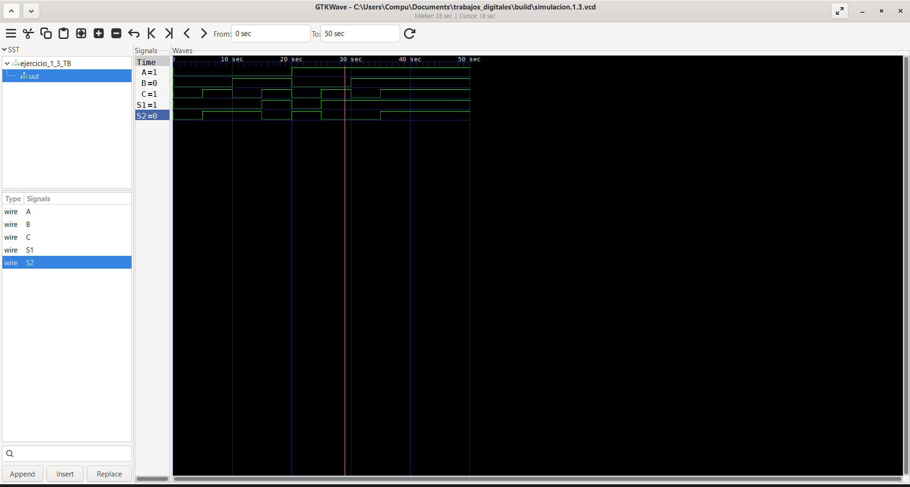
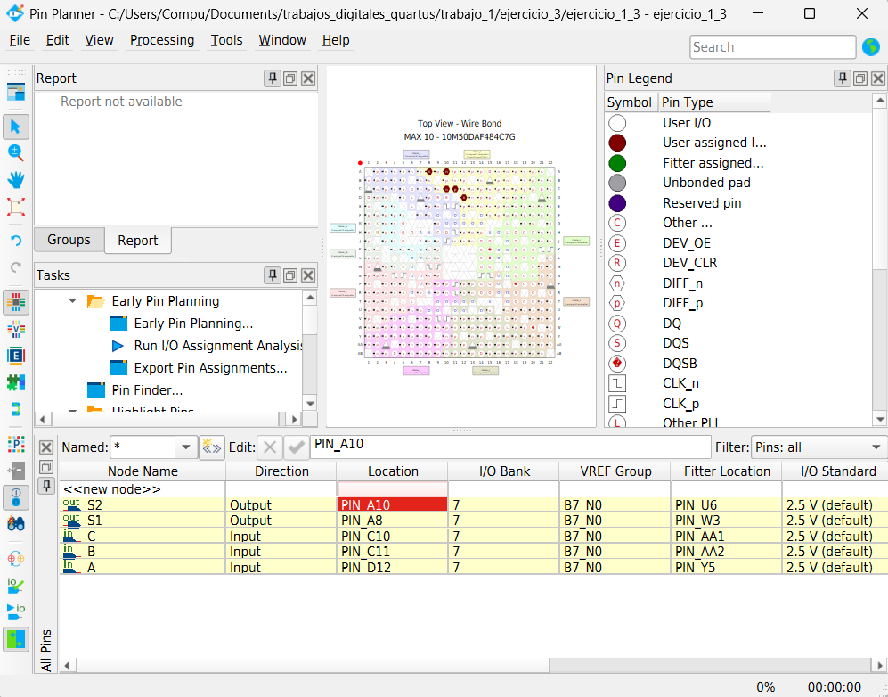

# Lab01 - Introducción a la lógica combinacional

## Integrantes

- [Juan Carlos Ramos Arias](https://github.com/juancramosar-droid)
- Daniel Ducuara

## Informe

### Índice

1. [Documentación del diseño implementado](#documentacion-del-diseno-implementado)
2. [Simulaciones](#simulaciones)
3. [Evidencias de implementación](#evidencias-de-implementacion)
4. [Conclusiones](#conclusiones)
5. [Referencias](#referencias)

<a id="documentacion-del-diseno-implementado"></a>

## 1. Documentación del diseño implementado

### 1.1 Compuertas lógicas

En esta primera parte del laboratorio se implementaron las compuertas lógicas fundamentales **NOT, AND, OR, XOR y XNOR** mediante lenguaje Verilog. El objetivo fue comprobar su funcionamiento y relacionar cada operación con su tabla de verdad.

Las entradas del circuito son `A` y `B`, y cada compuerta genera una salida independiente. La compuerta **NOT** utiliza únicamente la entrada `A`.

- **NOT:** invierte el estado lógico de la entrada.
- **AND:** genera una salida lógica `1` únicamente cuando ambas entradas son `1`.
- **OR:** genera una salida lógica `1` cuando al menos una entrada es `1`.
- **XOR:** genera una salida lógica `1` cuando las entradas son diferentes.
- **XNOR:** genera una salida lógica `1` cuando las entradas tienen el mismo valor.

| Compuerta | Expresión |
|:---:|:---:|
| NOT | `Y = ~A` |
| AND | `Y = A & B` |
| OR | `Y = A \| B` |
| XOR | `Y = A ^ B` |
| XNOR | `Y = ~(A ^ B)` |

El circuito también fue representado en el simulador **Digital**, donde se visualizan las conexiones entre las entradas y las salidas de cada operación lógica.


**Figura 1.** Diagrama de las compuertas lógicas implementadas en Digital.

#### Tabla de verdad

| A | B | NOT A | AND | OR | XOR | XNOR |
|:---:|:---:|:---:|:---:|:---:|:---:|:---:|
| 0 | 0 | 1 | 0 | 0 | 0 | 1 |
| 0 | 1 | 1 | 0 | 1 | 1 | 0 |
| 1 | 0 | 0 | 0 | 1 | 1 | 0 |
| 1 | 1 | 0 | 1 | 1 | 0 | 1 |

**Tabla 1.** Tabla de verdad de las compuertas lógicas implementadas.

#### Código Verilog

El diseño utiliza primitivas de Verilog para describir cada compuerta.

```verilog
module ejercicio_1_1(
    input A,
    input B,
    output SAND,
    output SNOT,
    output SOR,
    output SXOR,
    output SXNOR
);

    and  (SAND,  A, B);
    not  (SNOT,  A);
    or   (SOR,   A, B);
    xor  (SXOR,  A, B);
    xnor (SXNOR, A, B);

endmodule
```

### 1.2 Detector de números primos de 3 bits

En esta segunda parte se diseñó un circuito combinacional que determina si una entrada binaria de 3 bits representa un número primo entre 0 y 7. La salida `S` toma el valor lógico `1` para los números **2**, **3**, **5** y **7**, y permanece en `0` para los demás valores.

El módulo declara la entrada como `input [0:2] A`. En este rango ascendente, `A[0]` se utiliza como el bit más significativo, `A[1]` como el bit intermedio y `A[2]` como el bit menos significativo. Por tanto, la función implementada directamente por el código es:

`S = (~A[0] & A[1]) | (A[0] & A[2])`

Esta función activa `S` para `A[0:2] = 010`, `011`, `101` y `111`, que corresponden a los valores decimales 2, 3, 5 y 7 con el orden de bits declarado.

El circuito fue representado en **Digital** para observar la relación entre los tres bits de entrada y la salida.


**Figura 2.** Diagrama lógico del detector de números primos de 3 bits implementado en Digital.

#### Tabla de verdad

| `A[0]` | `A[1]` | `A[2]` | Decimal | `S` |
|:---:|:---:|:---:|:---:|:---:|
| 0 | 0 | 0 | 0 | 0 |
| 0 | 0 | 1 | 1 | 0 |
| 0 | 1 | 0 | 2 | 1 |
| 0 | 1 | 1 | 3 | 1 |
| 1 | 0 | 0 | 4 | 0 |
| 1 | 0 | 1 | 5 | 1 |
| 1 | 1 | 0 | 6 | 0 |
| 1 | 1 | 1 | 7 | 1 |

**Tabla 2.** Tabla de verdad del detector de números primos de 3 bits.

#### Código Verilog

```verilog
module ejercicio_1_2(
    input [0:2] A,
    output S
);

    wire C1;
    wire C2;
    wire C3;

    not (C1, A[0]);
    and (C2, C1, A[1]);
    and (C3, A[2], A[0]);
    or  (S, C2, C3);

endmodule
```

Las señales internas corresponden a `C1 = ~A[0]`, `C2 = ~A[0] & A[1]` y `C3 = A[0] & A[2]`. La salida resulta de la operación `S = C2 | C3`.

### 1.3 Sumador completo de 1 bit

En esta tercera parte se diseñó un **sumador completo de 1 bit** (*Full Adder*) mediante lenguaje Verilog. Las entradas `A` y `B` representan los bits que se suman, mientras que `C` corresponde al acarreo de entrada (*Carry In*).

El circuito produce dos salidas:

- `S1`: acarreo de salida (*Carry Out*).
- `S2`: bit de suma (*Sum*).

Las expresiones implementadas son:

- `S1 = (C & (A | B)) | (A & B)`
- `S2 = C ^ (A ^ B)`

La primera expresión equivale a `S1 = AB + AC + BC`; la segunda corresponde a `S2 = A XOR B XOR C`.

Las siguientes capturas muestran las representaciones del circuito en **Digital** conservadas en el informe original.


**Figura 3.** Vista del circuito sumador completo de 1 bit en Digital.


**Figura 4.** Diagrama lógico complementario del sumador completo de 1 bit en Digital.

#### Tabla de verdad

| A | B | C (*Carry In*) | `S1` (*Carry Out*) | `S2` (*Sum*) |
|:---:|:---:|:---:|:---:|:---:|
| 0 | 0 | 0 | 0 | 0 |
| 0 | 0 | 1 | 0 | 1 |
| 0 | 1 | 0 | 0 | 1 |
| 0 | 1 | 1 | 1 | 0 |
| 1 | 0 | 0 | 0 | 1 |
| 1 | 0 | 1 | 1 | 0 |
| 1 | 1 | 0 | 1 | 0 |
| 1 | 1 | 1 | 1 | 1 |

**Tabla 3.** Tabla de verdad del sumador completo de 1 bit.

#### Código Verilog

```verilog
module ejercicio_1_3 (
    input A,
    input B,
    input C,
    output S1,
    output S2
);

    assign S1 = (C & (A | B)) | (A & B);
    assign S2 = C ^ (A ^ B);

endmodule
```

<a id="simulaciones"></a>

## 2. Simulaciones

Para comprobar los tres diseños se utilizó **Icarus Verilog** para compilar y ejecutar los módulos y sus archivos de prueba. Los testbenches generaron archivos VCD, cuyas señales se visualizaron en **GTKWave**.

El flujo de trabajo fue:

`Código Verilog → Testbench → Icarus Verilog → Archivo VCD → GTKWave`

### 2.1 Simulación de compuertas lógicas

El testbench recorre las cuatro combinaciones posibles de `A` y `B` y registra las cinco salidas para compararlas con la Tabla 1.

```verilog
// Se incluye el archivo que contiene el módulo principal
`include "laboratorio_1_1.v"

// Se define la escala de tiempo
`timescale 1s/1s

module ejercicio_1_1_TB();

// Entradas del circuito utilizadas durante la simulación
reg A_TB;
reg B_TB;

// Salidas del circuito
wire SAND_TB;
wire SOR_TB;
wire SNOT_TB;
wire SXOR_TB;
wire SXNOR_TB;

// Instancia del módulo que se desea comprobar
ejercicio_1_1 uut (
    .A(A_TB),
    .B(B_TB),
    .SAND(SAND_TB),
    .SOR(SOR_TB),
    .SNOT(SNOT_TB),
    .SXOR(SXOR_TB),
    .SXNOR(SXNOR_TB)
);

initial begin

    // Caso 1: A = 0, B = 0
    A_TB = 1'b0;
    B_TB = 1'b0;
    #5;

    // Caso 2: A = 1, B = 0
    A_TB = 1'b1;
    B_TB = 1'b0;
    #5;

    // Caso 3: A = 0, B = 1
    A_TB = 1'b0;
    B_TB = 1'b1;
    #5;

    // Caso 4: A = 1, B = 1
    A_TB = 1'b1;
    B_TB = 1'b1;
    #5;

end

initial begin : TEST_CASE

    // Archivo utilizado para visualizar las señales en GTKWave
    $dumpfile("simulacion1.1.vcd");

    // Se almacenan las señales de la instancia uut
    $dumpvars(-1, uut);

    #50;
    $finish;

end


endmodule
```

La captura permite comparar `A` y `B` con las salidas `SAND`, `SNOT`, `SOR`, `SXNOR` y `SXOR`.


**Figura 5.** Simulación de las compuertas lógicas mediante Icarus Verilog y GTKWave.

### 2.2 Simulación del detector de números primos de 3 bits

El testbench aplica las ocho combinaciones binarias, desde `000` hasta `111`. Aunque la señal del banco de pruebas se declara como `reg [2:0] A_TB`, al conectarse con el puerto ascendente `input [0:2] A`, el extremo izquierdo del valor aplicado corresponde a `A[0]`. De este modo, los literales se interpretan en el mismo orden mostrado en la Tabla 2.

```verilog
// Se incluye el archivo que contiene el módulo principal
`include "laboratorio_1_2.v"

// Se define la escala de tiempo
`timescale 1s/1s

module ejercicio_1_2_TB();

// Entrada de 3 bits utilizada durante la simulación
reg [2:0] A_TB;

// Salida del circuito
wire S_TB;

// Instancia del módulo a comprobar
ejercicio_1_2 uut (
    .A(A_TB),
    .S(S_TB)
);

initial begin

    // Caso 1: decimal 0
    A_TB = 3'b000;
    #5;

    // Caso 2: decimal 1
    A_TB = 3'b001;
    #5;

    // Caso 3: decimal 2
    A_TB = 3'b010;
    #5;

    // Caso 4: decimal 3
    A_TB = 3'b011;
    #5;

    // Caso 5: decimal 4
    A_TB = 3'b100;
    #5;

    // Caso 6: decimal 5
    A_TB = 3'b101;
    #5;

    // Caso 7: decimal 6
    A_TB = 3'b110;
    #5;

    // Caso 8: decimal 7
    A_TB = 3'b111;
    #5;

end

initial begin : TEST_CASE

    // Archivo para almacenar las formas de onda
    $dumpfile("simulacion.1.2.vcd");

    // Se registran las señales de la instancia uut
    $dumpvars(-1, uut);

    #50;
    $finish;

end


endmodule
```

La salida esperada es `0, 0, 1, 1, 0, 1, 0, 1` para las entradas ordenadas desde `000` hasta `111`. La forma de onda debe activar `S` únicamente para los números primos indicados en la Tabla 2.


**Figura 6.** Simulación del detector de números primos mediante Icarus Verilog y GTKWave.

### 2.3 Simulación del sumador completo de 1 bit

El testbench recorre las ocho combinaciones de `A`, `B` y `C`. Durante la simulación, `S1_TB` representa el acarreo de salida y `S2_TB` representa el bit de suma.

```verilog
// Se incluye el archivo que contiene el módulo principal
`include "laboratorio_1_3.v"

// Se define la escala de tiempo
`timescale 1s/1s

module ejercicio_1_3_TB();

// Entradas utilizadas durante la simulación
reg A_TB;
reg B_TB;
reg C_TB;

// Salidas del circuito
wire S1_TB;
wire S2_TB;

// Instancia del módulo a comprobar
ejercicio_1_3 uut (
    .A(A_TB),
    .B(B_TB),
    .C(C_TB),
    .S1(S1_TB),
    .S2(S2_TB)
);

initial begin

    // Caso 1: A = 0, B = 0, C = 0
    C_TB = 1'b0;
    B_TB = 1'b0;
    A_TB = 1'b0;
    #5;

    // Caso 2: A = 0, B = 0, C = 1
    C_TB = 1'b1;
    B_TB = 1'b0;
    A_TB = 1'b0;
    #5;

    // Caso 3: A = 0, B = 1, C = 0
    C_TB = 1'b0;
    B_TB = 1'b1;
    A_TB = 1'b0;
    #5;

    // Caso 4: A = 0, B = 1, C = 1
    C_TB = 1'b1;
    B_TB = 1'b1;
    A_TB = 1'b0;
    #5;

    // Caso 5: A = 1, B = 0, C = 0
    C_TB = 1'b0;
    B_TB = 1'b0;
    A_TB = 1'b1;
    #5;

    // Caso 6: A = 1, B = 0, C = 1
    C_TB = 1'b1;
    B_TB = 1'b0;
    A_TB = 1'b1;
    #5;

    // Caso 7: A = 1, B = 1, C = 0
    C_TB = 1'b0;
    B_TB = 1'b1;
    A_TB = 1'b1;
    #5;

    // Caso 8: A = 1, B = 1, C = 1
    C_TB = 1'b1;
    B_TB = 1'b1;
    A_TB = 1'b1;
    #5;

end

initial begin : TEST_CASE

    $dumpfile("simulacion.1.3.vcd");
    $dumpvars(-1, uut);

    #50;
    $finish;

end


endmodule
```

La forma de onda permite contrastar las salidas con la Tabla 3 y comprobar que `S1` es *Carry Out* y `S2` es *Sum*.



**Figura 7.** Formas de onda del sumador completo de 1 bit visualizadas en GTKWave.

<a id="evidencias-de-implementacion"></a>

## 3. Evidencias de implementación

Los diseños se compilaron en **Quartus Prime** y se implementaron en una tarjeta **FPGA DE10-Lite**. Para cada ejercicio se estableció el módulo correspondiente como entidad de nivel superior (*Top-Level Entity*), se ejecutaron los procesos de análisis, síntesis y compilación, y se asignaron las señales mediante **Pin Planner**. Finalmente, los archivos de programación se cargaron mediante **Programmer** y la interfaz **USB-Blaster**.

### 3.1 Compuertas lógicas

Las entradas `A` y `B` se asociaron a interruptores de la tarjeta, y las salidas de las compuertas se conectaron a LED.

| Señal | Dirección | Pin asignado |
|:---:|:---:|:---:|
| `A` | Entrada | `PIN_C10` |
| `B` | Entrada | `PIN_C11` |
| `SAND` | Salida | `PIN_A9` |
| `SNOT` | Salida | `PIN_A8` |
| `SOR` | Salida | `PIN_A10` |
| `SXNOR` | Salida | `PIN_D13` |
| `SXOR` | Salida | `PIN_B10` |

**Tabla 4.** Asignación de pines de las compuertas lógicas.


**Figura 8.** Asignación de las entradas y salidas de las compuertas en Pin Planner.

La implementación física permitió comprobar que los estados observados en los LED coincidían con la Tabla 1 y con las formas de onda de la simulación.

### 3.2 Detector de números primos de 3 bits

Los bits de entrada se asociaron a tres interruptores y la salida `S` a un LED. La nomenclatura se conserva exactamente como aparece en el módulo `input [0:2] A` y en la captura de Pin Planner.

| Señal | Dirección | Elemento en la DE10-Lite | Pin asignado |
|:---:|:---:|:---:|:---:|
| `A[2]` | Entrada | Interruptor | `PIN_C10` |
| `A[1]` | Entrada | Interruptor | `PIN_C11` |
| `A[0]` | Entrada | Interruptor | `PIN_D12` |
| `S` | Salida | LED | `PIN_A8` |

**Tabla 5.** Asignación de pines del detector de números primos.


**Figura 9.** Asignación de la entrada de 3 bits y la salida del detector en Pin Planner.

El funcionamiento se comprobó modificando los tres interruptores. El LED asociado a `S` se activó para las combinaciones correspondientes a los números decimales 2, 3, 5 y 7.

### 3.3 Sumador completo de 1 bit

Las entradas `A`, `B` y `C` se asociaron a interruptores, mientras que las salidas `S1` y `S2` se conectaron a LED. En este diseño, **`S1` es el acarreo de salida (*Carry Out*) y `S2` es el bit de suma (*Sum*)**.

| Señal | Dirección | Elemento en la DE10-Lite | Pin asignado |
|:---:|:---:|:---:|:---:|
| `A` | Entrada | Interruptor | `PIN_D12` |
| `B` | Entrada | Interruptor | `PIN_C11` |
| `C` | Entrada | Interruptor (*Carry In*) | `PIN_C10` |
| `S1` | Salida | LED (*Carry Out*) | `PIN_A8` |
| `S2` | Salida | LED (*Sum*) | `PIN_A10` |

**Tabla 6.** Asignación de pines del sumador completo de 1 bit.



**Figura 10.** Asignación de las entradas y salidas del sumador completo en Pin Planner.

Las combinaciones aplicadas físicamente se compararon con la Tabla 3 y con la simulación de GTKWave.

<a id="conclusiones"></a>

## 4. Conclusiones

1. La implementación de las compuertas lógicas permitió comprobar el comportamiento de las operaciones fundamentales **NOT, AND, OR, XOR y XNOR**, verificando mediante simulación que las salidas coincidieran con sus tablas de verdad.

2. El detector de números primos de 3 bits permitió aplicar el análisis de funciones booleanas para identificar correctamente los valores primos comprendidos entre 0 y 7. La revisión del rango `input [0:2] A` también evidenció la importancia de mantener un orden de bits consistente entre el código, las tablas y la asignación física.

3. La implementación del sumador completo de 1 bit permitió comprender el funcionamiento conjunto del bit de suma `S2` y del acarreo de salida `S1`, así como su utilidad como bloque básico en sistemas aritméticos de varios bits.

4. El uso de **Icarus Verilog** y **GTKWave** permitió verificar los diseños antes de su implementación física y comparar las formas de onda con los resultados esperados.

5. El uso de **Quartus Prime** y de la tarjeta **FPGA DE10-Lite** permitió trasladar los diseños descritos en Verilog a una implementación real mediante interruptores y LED.

6. La comparación de las tablas de verdad, las simulaciones y las pruebas físicas permitió comprobar el comportamiento lógico esperado de los tres circuitos.

7. El laboratorio integró las etapas fundamentales de un flujo de diseño digital: planteamiento lógico, descripción mediante HDL, simulación, asignación de pines, compilación y programación de una FPGA.

<a id="referencias"></a>

## 5. Referencias

- Intel. [Quartus Prime Design Software](https://www.intel.com/content/www/us/en/products/details/fpga/development-tools/quartus-prime/resource.html).
- Terasic. [DE10-Lite Development and Education Board: documentos y manual del usuario](https://www.terasic.com.tw/cgi-bin/page/archive.pl?CategoryNo=205&Language=English&No=1021&PartNo=4).
- Williams, S. [Documentación de Icarus Verilog](https://steveicarus.github.io/iverilog/).
- GTKWave. [Sitio y documentación oficial](https://gtkwave.sourceforge.net/).
- Neemann, H. [Digital: diseñador y simulador de circuitos lógicos](https://github.com/hneemann/Digital).
