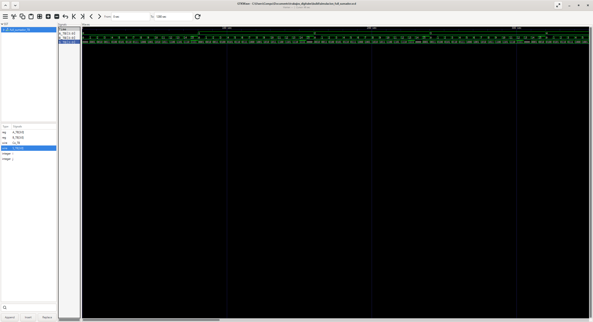
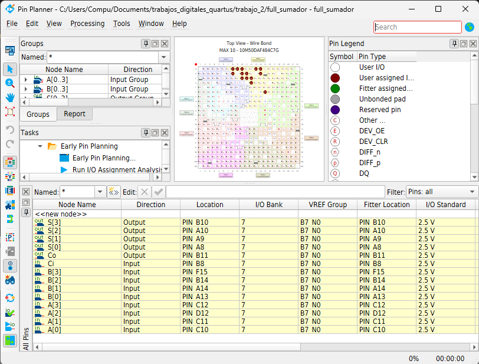

# Lab01 - Sumador de 4 bits

## Integrantes

- [Juan Carlos Ramos Arias](https://github.com/juancramosar-droid)
- Daniel Ducuara

## Informe

### Índice

1. [Documentación del diseño implementado](#documentacion-del-diseno-implementado)
2. [Simulaciones](#simulaciones)
3. [Evidencias de implementación](#evidencias-de-implementacion)
4. [Conclusiones](#conclusiones)
5. [Referencias](#referencias)

<a id="documentacion-del-diseno-implementado"></a>

## 1. Documentación del diseño implementado

### 1.1 Descripción general

En esta actividad se diseñó un **sumador binario de 4 bits** mediante lenguaje Verilog. El circuito recibe dos operandos, `A[3:0]` y `B[3:0]`, y genera un resultado de 4 bits en `S[3:0]`, además de un acarreo de salida `Co`.

El diseño se construyó de forma estructural a partir de cuatro sumadores completos de 1 bit conectados en cascada. El acarreo producido por cada etapa se utiliza como acarreo de entrada de la etapa siguiente; esta arquitectura se conoce como **sumador de acarreo propagado** (*ripple-carry adder*).

La relación funcional del circuito es:

`{Co, S[3:0]} = A[3:0] + B[3:0]`

En el código suministrado, el acarreo de entrada de la primera etapa está conectado de manera fija a `1'b0`. Por tanto, el módulo realiza la suma de `A` y `B` sin un acarreo de entrada externo.

| `A` | `B` | Resultado decimal | `Co` | `S` |
|:---:|:---:|:---:|:---:|:---:|
| `0000` | `0000` | 0 | `0` | `0000` |
| `0000` | `1111` | 15 | `0` | `1111` |
| `0001` | `0001` | 2 | `0` | `0010` |
| `0111` | `0001` | 8 | `0` | `1000` |
| `1111` | `0001` | 16 | `1` | `0000` |
| `1111` | `1111` | 30 | `1` | `1110` |

**Tabla 1.** Casos representativos del funcionamiento del sumador de 4 bits.

### 1.2 Sumador completo de 1 bit

El módulo `sumador_1bit` constituye la unidad básica del diseño. Recibe los bits `A` y `B`, además del acarreo de entrada `Ci`, y produce el bit de suma `S` y el acarreo de salida `Co`.

Las expresiones implementadas son:

- `Co = (Ci & (A | B)) | (A & B)`
- `S = Ci ^ (A ^ B)`

La salida `Co` se activa cuando al menos dos de las tres entradas tienen un nivel lógico alto. La salida `S` corresponde a la operación XOR entre los dos operandos y el acarreo de entrada.

#### Código Verilog del sumador de 1 bit

Archivo sugerido: `laboratorio_1_4A.v`.

```verilog
module sumador_1bit (
    input A,
    input B,
    input Ci,
    output Co,
    output S
);

    assign Co = (Ci & (A | B)) | (A & B);
    assign S  = Ci ^ (A ^ B);

endmodule
```

### 1.3 Sumador de 4 bits

El módulo `full_sumador` instancia cuatro veces el módulo `sumador_1bit`. El bloque `bit0` opera sobre los bits menos significativos y recibe un acarreo inicial igual a cero. Sus acarreos internos `C1`, `C2` y `C3` se propagan hasta el bloque `bit3`, que produce el acarreo final `Co`.

La conexión entre etapas sigue esta secuencia:

`bit0 → C1 → bit1 → C2 → bit2 → C3 → bit3 → Co`

#### Código Verilog del sumador de 4 bits

Archivo sugerido: `laboratorio_1_4B.v`.

```verilog
`include "laboratorio_1_4A.v"

module full_sumador (
    input  [3:0] A,
    input  [3:0] B,
    output       Co,
    output [3:0] S
);

    wire C1;
    wire C2;
    wire C3;

   
    sumador_1bit bit0 (
        .A(A[0]),
        .B(B[0]),
        .Ci(1'b0),
        .Co(C1),
        .S(S[0])
    );


    sumador_1bit bit1 (
        .A(A[1]),
        .B(B[1]),
        .Ci(C1),
        .Co(C2),
        .S(S[1])
    );

    sumador_1bit bit2 (
        .A(A[2]),
        .B(B[2]),
        .Ci(C2),
        .Co(C3),
        .S(S[2])
    );

  
    sumador_1bit bit3 (
        .A(A[3]),
        .B(B[3]),
        .Ci(C3),
        .Co(Co),
        .S(S[3])
    );

endmodule
```

<a id="simulaciones"></a>

## 2. Simulaciones

### 2.1 Estrategia de verificación

La simulación se realizó con **Icarus Verilog** y las formas de onda se visualizaron en **GTKWave**. El testbench utiliza dos ciclos `for` anidados para recorrer todas las combinaciones posibles de los operandos:

- `A_TB` recorre los 16 valores comprendidos entre `0000` y `1111`.
- Para cada valor de `A_TB`, `B_TB` también recorre los 16 valores posibles.
- Cada combinación se mantiene durante 5 unidades de tiempo.

En total se prueban `16 × 16 = 256` combinaciones. Con la escala `` `timescale 1s/1s ``, la simulación tiene una duración total de 1280 segundos simulados.

### 2.2 Testbench

Archivo sugerido: `laboratorio_1_4_TB.v`.

```verilog
`timescale 1s/1s

`include "laboratorio_1_4B.v"

module full_sumador_TB();


reg [3:0] A_TB;
reg [3:0] B_TB;


wire [3:0] S_TB;
wire       Co_TB;


integer i;
integer j;


full_sumador uut (
    .A(A_TB),
    .B(B_TB),
    .Co(Co_TB),
    .S(S_TB)
);

initial begin

 
    for (i = 0; i < 16; i = i + 1) begin
        for (j = 0; j < 16; j = j + 1) begin

            A_TB = i;
            B_TB = j;

            #5;
        end
    end
    $finish;
end

initial begin

    $dumpfile("simulacion_full_sumador.vcd");
    $dumpvars(0, full_sumador_TB);

end


endmodule
```

### 2.3 Resultados de la simulación

La captura de GTKWave muestra las señales `A_TB[3:0]`, `B_TB[3:0]` y `S_TB[3:0]`. Se observa que `B_TB` recorre repetidamente los valores de 0 a 15, mientras que `A_TB` aumenta una unidad después de completar cada ciclo de `B_TB`. La salida `S_TB` cambia de acuerdo con la suma binaria de los operandos.



**Figura 1.** Formas de onda del sumador de 4 bits visualizadas en GTKWave.

La señal `Co_TB` está declarada en el testbench y aparece disponible en el panel de señales, pero no está agregada al área de formas de onda de la captura. Por esta razón, la imagen permite verificar visualmente `S_TB`, pero no demuestra por sí sola el comportamiento del acarreo final. Para documentarlo gráficamente, debe añadirse `Co_TB` al panel de ondas de GTKWave y tomar una nueva captura.

<a id="evidencias-de-implementacion"></a>

## 3. Evidencias de implementación

### 3.1 Implementación en Quartus Prime

El diseño fue preparado en **Quartus Prime** para una FPGA **MAX 10** de la tarjeta **DE10-Lite**. La captura del **Pin Planner** muestra la asociación de los operandos, el resultado y el acarreo con los pines físicos del dispositivo.



**Figura 2.** Asignación de señales del sumador de 4 bits en Pin Planner.

### 3.2 Asignación de pines

| Señal | Dirección | Pin asignado | Estándar de E/S |
|:---:|:---:|:---:|:---:|
| `A[0]` | Entrada | `PIN_C10` | 2.5 V |
| `A[1]` | Entrada | `PIN_C11` | 2.5 V |
| `A[2]` | Entrada | `PIN_D12` | 2.5 V |
| `A[3]` | Entrada | `PIN_C12` | 2.5 V |
| `B[0]` | Entrada | `PIN_A13` | 2.5 V |
| `B[1]` | Entrada | `PIN_A14` | 2.5 V |
| `B[2]` | Entrada | `PIN_B14` | 2.5 V |
| `B[3]` | Entrada | `PIN_F15` | 2.5 V |
| `Ci` | Entrada | `PIN_B8` | 2.5 V |
| `Co` | Salida | `PIN_B11` | 2.5 V |
| `S[0]` | Salida | `PIN_A8` | 2.5 V |
| `S[1]` | Salida | `PIN_A9` | 2.5 V |
| `S[2]` | Salida | `PIN_A10` | 2.5 V |
| `S[3]` | Salida | `PIN_B10` | 2.5 V |

**Tabla 2.** Asignación de pines mostrada en la captura de Quartus Prime.

### 3.3 Observación de consistencia

La captura de Pin Planner incluye una entrada `Ci` asignada a `PIN_B8`. Sin embargo, el módulo `full_sumador` suministrado no declara `Ci` como puerto de entrada, ya que conecta la primera etapa directamente a `.Ci(1'b0)`.

Por tanto, el código y la captura corresponden a configuraciones ligeramente diferentes:

- **Código suministrado:** calcula `A + B` con acarreo inicial fijo en cero.
- **Captura de Pin Planner:** muestra una versión que aparentemente expone `Ci` como entrada externa.

Antes de presentar una prueba física definitiva, debe confirmarse cuál versión se cargó en la FPGA. Si se mantiene el código incluido en este informe, la asignación de `Ci` no es necesaria. Si se desea utilizar el interruptor conectado a `PIN_B8`, el módulo superior y el testbench deben incorporar explícitamente esa entrada.

<a id="conclusiones"></a>

## 4. Conclusiones

1. La construcción del sumador de 4 bits a partir de cuatro módulos de 1 bit permitió aplicar un diseño jerárquico y reutilizable en Verilog.

2. La conexión en cascada de `C1`, `C2` y `C3` permitió propagar el acarreo desde el bit menos significativo hasta la salida final `Co`.

3. El testbench recorrió las 256 combinaciones posibles de `A_TB` y `B_TB`, proporcionando una verificación exhaustiva del espacio de entradas para la suma sin acarreo inicial externo.

4. La captura de GTKWave permitió comprobar el comportamiento del vector de suma `S_TB`. No obstante, es necesario agregar `Co_TB` al área de ondas para dejar evidencia visual completa del acarreo final.

5. La asignación realizada en Quartus Prime relacionó los bits de entrada y salida con los pines físicos de la FPGA. La presencia de `Ci` en la captura debe conciliarse con la versión final del módulo superior antes de afirmar que ambas evidencias corresponden exactamente al mismo diseño.

6. El desarrollo integró descripción HDL, diseño modular, simulación, análisis de formas de onda y preparación de la implementación en FPGA.

<a id="referencias"></a>

## 5. Referencias

- Intel. [Quartus Prime Design Software](https://www.intel.com/content/www/us/en/products/details/fpga/development-tools/quartus-prime/resource.html).
- Terasic. [DE10-Lite Development and Education Board: documentos y manual del usuario](https://www.terasic.com.tw/cgi-bin/page/archive.pl?CategoryNo=205&Language=English&No=1021&PartNo=4).
- Williams, S. [Documentación de Icarus Verilog](https://steveicarus.github.io/iverilog/).
- GTKWave. [Sitio y documentación oficial](https://gtkwave.sourceforge.net/).

